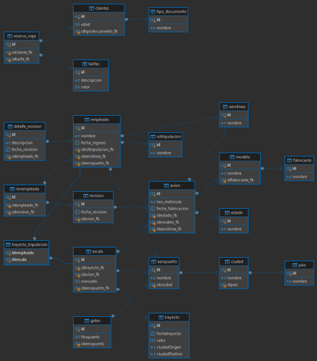

# MODELO CONCEPTUAL 
## Entidades 
1. **País**
- id
- nombre
2. **Ciudad**
- id
- nombre
- idpais
 3. **Aeropuerto**
- id
- nombre
- idciudad

 4. **Puerta (Gate)**
- id
- NropuertO
-  idaeropuerto

 5. **Aerolínea**
- id
- nombre
 6. **Fabricante**
- id
- nombre
 7. **Modelo**
- id
- nombre
- idfabricante_fk

 8. **Estado**
- id
- nombre

 9. **Avión**
- id 
- nro_matricula
- fecha_fabricacion
-  idestado_fk
-  idmodelo_fk
-  idaerolinea_fk

10. **Rol de Tripulación**
- id
-  nombre
 11. **Empleado**
- id
-  nombre
-  fecha_ingreso
-  idroltripulacion_fk
-  idaerolinea_fk
-  idaeropuerto_fk
 12. **Revisión**
- id
-  fecha_revision
-  idavion_fk

 13. **Revisión Empleado**
- id
-  idempleado_fk
-  idrevision_fk
 14. **Detalle de Revisión**
 - id
 -  descripcion
 -  fecha_revision
 -  idempleado_fk
 15. **Trayecto**
- id
-  fechatrayecto
-  valor
-  ciudadOrigen
-  ciudadDestino
 16. **Escala**
- id
-  idtrayecto_fk
-  idavion_fk
-  nrovuelo
-  idaeropuerto_fk

 17. **Trayecto Tripulación**
 - idempleado
 -  idescala
18. **Tipo de Documento**
 - id
 -  nombre
 19. **Cliente**
- id
-  edad
-  idtipodocumento_fk

 20. **Tarifa**
- id
-  descripcion
-  valor
 21. **Reserva de Viaje**
- id
-  idcliente_fk
-  idtarifa_fk

## Relaciones 

**País - Ciudad**
Un país puede tener muchas ciudades (1).

**Ciudad - Aeropuerto**
Una ciudad puede tener muchos aeropuertos (1).

**Aeropuerto - Puerta**
Un aeropuerto puede tener muchas puertas (1).

**Aerolínea - Avión**
Una aerolínea puede tener muchos aviones (1).

**Fabricante - Modelo**
Un fabricante puede producir muchos modelos de aviones (1).

**Estado - Avión**
Un estado puede estar asociado con muchosaviones (1).

**Modelo - Avión**
Un modelo puede ser usado por muchos aviones (1).

**Rol de Tripulación - Empleado**
Un rol puede ser asignado a muchos empleados (1).

**Aeropuerto - Empleado**
Un aeropuerto puede emplear a muchos empleados(1).

**Revisión - Avión**
 Un avión puede tener muchas revisiones (1).

**Empleado - Revisión Empleado**
Un empleado puede estar asociado con muchasrevisiones (1).

**Revisión - Detalle de Revisión**
 Una revisión puede tener muchos detalles (1).

**Trayecto - Escala**
 Un trayecto puede tener muchas escalas (1).

**Avión - Escala**
 Un avión puede participar en muchas escalas (1).

**Empleado - Trayecto Tripulación**
 Un empleado puede estar en muchos trayectos (1).

**Tipo de Documento - Cliente**
 Un tipo de documento puede ser asociado a muchos clientes (1).

**Cliente - Reserva de Viaje**
 Un cliente puede tener muchas reservas de viaje (1).

**Tarifa - Reserva de Viaje**
 Una tarifa puede ser usada en muchas reservas (1).

# MODELO LOGICO 

1. País
   - id (PK)
   -  nombre
2. Ciudad
   - id (PK)
   -  nombre
   -  idpais (FK -> País.id)
3. Aeropuerto
   - id (PK)
   -  nombre
   -  idciudad (FK -> Ciudad.id)
4. Gates
   - id (PK)
   -  Nropuerta
   -  idaeropuerto (FK -> Aeropuerto.id)
5. Aerolínea
   - id (PK)
   -  nombre
6. Fabricante
   - id (PK)
   -  nombre
7. Modelo
   - id (PK)
   -  nombre
   -  idfabricante_fk (FK -> Fabricante.id)
8. Estado
   - id (PK)
   -  nombre
9. Avión
   - id (PK)
   -  nro_matricula
   -  fecha_fabricacion
   -  idestado_fk (FK -> Estado.id)
   -  idmodelo_fk (FK -> Modelo.id)
   -  idaerolinea_fk (FK -> Aerolínea.id)
10. Rol de Tripulación
    - id (PK)
    -  nombre
11. Empleado
    - id (PK)
    -  nombre
    -  fecha_ingreso
    -  idroltripulacion_fk (FK -> Rol de Tripulación.id)
    -  idaerolinea_fk (FK -> Aerolínea.id)
    -  idaeropuerto_fk (FK -> Aeropuerto.id)
12. Revisión
    - id (PK)
    -  fecha_revision
    -  idavion_fk (FK -> Avión.id)
13. Revisión Empleado
    - id (PK)
    -  idempleado_fk (FK -> Empleado.id)
    -  idrevision_fk (FK -> Revisión.id)
14. Detalle de Revisión
    - id (PK)
    -  descripcion
    -  fecha_revision
    -  idempleado_fk (FK -> Empleado.id)
15. Trayecto
    - id (PK)
    - fechatrayecto
    -  valor
    -  ciudadOrigen
    -  ciudadDestino
16. Escala
    - id (PK)
    -  idtrayecto_fk (FK -> Trayecto.id)
    -  idavion_fk (FK -> Avión.id)
    -  nrovuelo
    -  idaeropuerto_fk (FK -> Aeropuerto.id)
17. Trayecto Tripulación
    - idempleado (FK -> Empleado.id)
    -  idescala (FK -> Escala.id)
    -  (PK: idempleado, idescala)
18. Tipo de Documento
    - id (PK)
    -  nombre
19. Clientes
    - id (PK)
    -  edad
    -  idtipodocumento_fk (FK -> Tipo de Documento.id)
20. Tarifas
    - id (PK)
    -  descripcion
    -  valor
21. Reserva de Viaje
    - id (PK)
    -  idcliente_fk (FK -> Clientes.id)
    -  idtarifa_fk (FK -> Tarifas.id)
# MODELO FISICO  

````sql
CREATE TABLE pais ( 
    id INT(5) PRIMARY KEY, 
    nombre VARCHAR(30) );
 
CREATE TABLE ciudad ( 
    id INT(5) PRIMARY KEY,
    nombre VARCHAR(30),
    idpais INT, 
    FOREIGN KEY (idpais) REFERENCES pais(id) );
    
CREATE TABLE aeropuerto (  
    id INT(30) PRIMARY KEY, 
    nombre VARCHAR(50), 
    idciudad INT,
    FOREIGN KEY (idciudad) REFERENCES ciudad(id) );
    
CREATE TABLE gates (  
    id INT PRIMARY KEY AUTO_INCREMENT, 
    Nropuerta INT,  idaeropuerto INT,  
    FOREIGN KEY (idaeropuerto ) REFERENCES aeropuerto(id) );
    
CREATE TABLE aerolinea ( 
    id INT NOT NULL PRIMARY KEY AUTO_INCREMENT, 
    nombre VARCHAR(30) );
    
CREATE TABLE fabricante(   
    id INT NOT NULL PRIMARY KEY AUTO_INCREMENT,
    nombre VARCHAR(30) );
    
CREATE TABLE modelo( 
    id INT NOT NULL PRIMARY KEY AUTO_INCREMENT,
    nombre VARCHAR(30), 
    idfabricante_fk INT,
    FOREIGN KEY (idfabricante_fk) REFERENCES fabricante(id) 
);

CREATE TABLE estado( 
    id INT NOT NULL PRIMARY KEY,
    nombre VARCHAR(30) ); 
CREATE TABLE avion( 
    id INT NOT NULL PRIMARY KEY AUTO_INCREMENT,
    nro_matricula VARCHAR(30), 
    fecha_fabricacion DATE, 
    idestado_fk INT, 
    idmodelo_fk INT,
    idaerolinea_fk INT, 
    FOREIGN KEY (idestado_fk) REFERENCES estado(id),
    FOREIGN KEY (idmodelo_fk) REFERENCES modelo(id),
    FOREIGN KEY (idaerolinea_fk) REFERENCES aerolinea(id)
);

CREATE TABLE roltripulacion ( 
    id INT PRIMARY KEY AUTO_INCREMENT,
    nombre VARCHAR(30) 
);

CREATE TABLE empleado (  
    id INT PRIMARY KEY AUTO_INCREMENT, 
    nombre VARCHAR(30),
    fecha_ingreso DATE,
    idroltripulacion_fk INT, 
    idaerolinea_fk INT, 
    idaeropuerto_fk INT, 
    FOREIGN KEY (idaeropuerto_fk) REFERENCES aeropuerto(id),
    FOREIGN KEY (idaerolinea_fk) REFERENCES aerolinea(id), 
    FOREIGN KEY (idroltripulacion_fk) REFERENCES roltripulacion(id) 
);

CREATE TABLE revision (
    id INT NOT NULL PRIMARY KEY AUTO_INCREMENT,
    fecha_revision DATE, 
    idavion_fk INT, 
    FOREIGN KEY (idavion_fk) REFERENCES avion(id) 
); 

CREATE TABLE revempleado ( 
    id INT NOT NULL PRIMARY KEY AUTO_INCREMENT, 
    idempleado_fk INT,
    idrevision_fk INT,
    FOREIGN KEY (idempleado_fk) REFERENCES empleado(id), 
    FOREIGN KEY (idrevision_fk) REFERENCES revision(id) 
); 
CREATE TABLE detalle_revision ( 
    id INT PRIMARY KEY AUTO_INCREMENT,
    descripcion VARCHAR(255),
    fecha_revision DATE, 
    idempleado_fk INT, 
    FOREIGN KEY (idempleado_fk) REFERENCES empleado(id) 
); 

CREATE TABLE trayecto ( 
    id INT PRIMARY KEY AUTO_INCREMENT,
    fechatrayecto DATE, 
    valor DOUBLE,  
    ciudadOrigen VARCHAR(30), 
    ciudadDestino VARCHAR(30)
);

CREATE TABLE escala ( 
    id INT PRIMARY KEY AUTO_INCREMENT,
    idtrayecto_fk INT,
    idavion_fk INT, 
    nrovuelo INT, 
    idaeropuerto_fk INT,
    FOREIGN KEY (idtrayecto_fk) REFERENCES trayecto(id), 
    FOREIGN KEY (idavion_fk) REFERENCES avion(id),  
    FOREIGN KEY (idaeropuerto_fk) REFERENCES aeropuerto(id) 
); 

CREATE TABLE trayecto_tripulacion ( 
    idempleado INT,
    idescala INT, 
    PRIMARY KEY (idempleado, idescala), 
    FOREIGN KEY (idempleado) REFERENCES empleado(id), 
    FOREIGN KEY (idescala) REFERENCES escala(id) 
);

CREATE TABLE tipo_documento( 
    id INT NOT NULL PRIMARY KEY AUTO_INCREMENT,
    nombre VARCHAR(50) 
);

CREATE TABLE clientes(
    id VARCHAR(20) PRIMARY KEY, 
    edad INT, 
    idtipodocumento_fk INT,
    FOREIGN KEY (idtipodocumento_fk) REFERENCES tipo_documento(id) 
); 

CREATE TABLE tarifas( 
    id INT NOT NULL PRIMARY KEY AUTO_INCREMENT,
    descripcion VARCHAR(255),
    valor DECIMAL(5,2) 
);

CREATE TABLE reserva_viaje(
    id INT NOT NULL PRIMARY KEY AUTO_INCREMENT,
    idcliente_fk VARCHAR(20),
    idtarifa_fk INT, 
    FOREIGN KEY (idcliente_fk) REFERENCES clientes(id),
    FOREIGN KEY (idtarifa_fk) REFERENCES tarifas(id) );
````

      

# DIAGRAMA DBever


      
