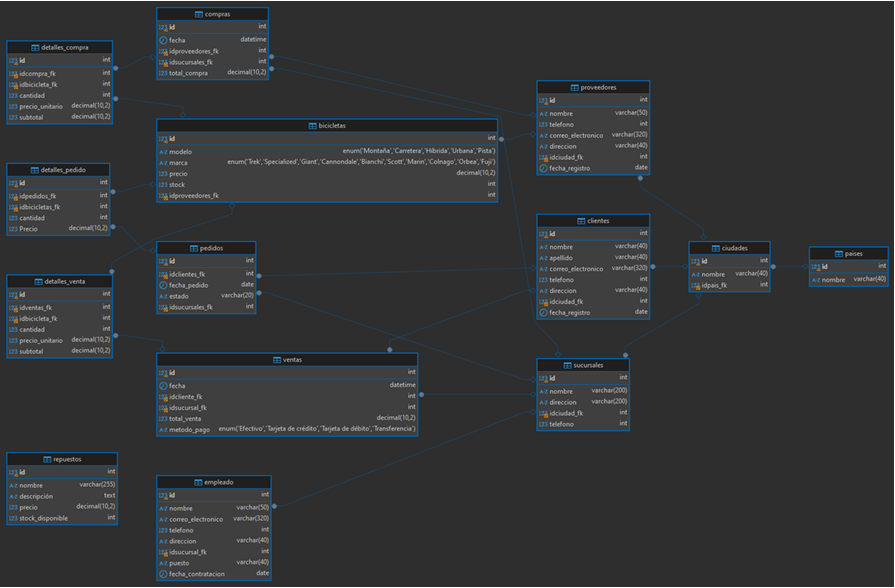
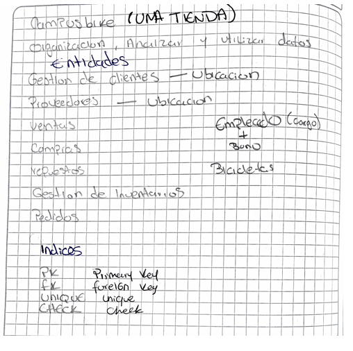

# Ayelmer Jusephe Corzo Barbosa 

## Modelo Conceptual

### Entidades
- **Compras**: Representa una compra de una bicicleta.
- **Bicicletas**: Describe el tipo de bicicleta.
- **Proveedores**: Almacena la información de los proveedores.
- **Clientes**: Contiene la información de los clientes.
- **Pedidos**: Registra los pedidos de bicicletas.
- **Detalles Pedido**: Detalla las bicicletas incluidas en un pedido.
- **Ventas**: Representa una venta de una bicicleta.
- **Detalles Venta**: Detalla las bicicletas incluidas en una venta.
- **Repuestos**: Guarda la información sobre los repuestos disponibles.
- **Empleado**: Almacena la información de los empleados.
- **Ciudades**: Describe las ciudades.
- **Países**: Guarda la información sobre los países.
- **Sucursales**: Representa las sucursales de la empresa.

### Relaciones
- **Compras contiene Bicicletas**: Una compra incluye una o más bicicletas.
- **Compras realizadas por Clientes**: Una compra la realiza un cliente.
- **Compras registradas por Empleado**: Una compra es registrada por un empleado.
- **Compras se realiza en Sucursales**: Una compra se realiza en una sucursal.
- **Bicicletas proviene de Proveedores**: Una bicicleta proviene de un proveedor.
- **Clientes realiza Pedidos**: Un cliente realiza pedidos.
- **Pedidos incluye Bicicletas**: Un pedido puede incluir varias bicicletas.
- **Pedidos se registra en Sucursales**: Un pedido se registra en una sucursal.
- **Ventas realiza Clientes**: Una venta la realiza un cliente.
- **Ventas incluye Bicicletas**: Una venta incluye una o más bicicletas.
- **Venta registrada por Empleado**: Una venta es registrada por un empleado.
- **Ventas se realiza en Sucursales**: Una venta se realiza en una sucursal.
- **Ciudades pertenece a Países**: Una ciudad pertenece a un país.

## Modelo Lógico

### Compras
- `id`: Identificador único de cada compra
- `fecha`: Fecha de la compra
- `idproveedores_fk`: Identificador del proveedor de la compra
- `idsucursales_fk`: Identificador de la sucursal donde se realizó la compra
- `idcompra_fk`: Identificador de la compra
- `total_compra`: Total de la compra

### Bicicletas
- `id`: Identificador único de cada bicicleta
- `nombre`: Nombre de la bicicleta
- `telefono`: Número de teléfono del proveedor de la bicicleta
- `modelo`: Tipo de modelo de la bicicleta
- `marca`: Marca de la bicicleta

### Proveedores
- `id`: Identificador único de cada proveedor
- `nombre`: Nombre del proveedor
- `correo_electronico`: Correo electrónico del proveedor
- `direccion`: Dirección del proveedor
- `idciudad_fk`: Identificador de la ciudad del proveedor
- `fecha_registro`: Fecha de registro del proveedor

### Detalles Pedido
- `id`: Identificador único de cada detalle de pedido
- `idpedidos_fk`: Identificador del pedido
- `idbicicletas_fk`: Identificador de la bicicleta del pedido
- `cantidad`: Cantidad de bicicletas en el pedido
- `precio`: Precio unitario de la bicicleta

### Pedidos
- `id`: Identificador único de cada pedido
- `idclientes_fk`: Identificador del cliente del pedido
- `fecha_pedido`: Fecha del pedido
- `estado`: Estado actual del pedido
- `idsucursales_fk`: Identificador de la sucursal del pedido

### Detalles Venta
- `id`: Identificador único de cada detalle de venta
- `idventas_fk`: Identificador de la venta
- `idbicicleta_fk`: Identificador de la bicicleta de la venta
- `cantidad`: Cantidad de bicicletas en la venta
- `precio_unitario`: Precio unitario de la bicicleta
- `subtotal`: Subtotal de la venta

### Repuestos
- `id`: Identificador único de cada repuesto
- `nombre`: Nombre del repuesto
- `descripcion`: Descripción del repuesto
- `precio`: Precio del repuesto
- `stock_disponible`: Cantidad de stock disponible del repuesto

### Ventas
- `id`: Identificador único de cada venta
- `idclientes_fk`: Identificador del cliente de la venta
- `fecha_venta`: Fecha de la venta
- `total_venta`: Total de la venta
- `idsucursales_fk`: Identificador de la sucursal de la venta

### Sucursales
- `id`: Identificador único de cada sucursal
- `nombre`: Nombre de la sucursal
- `direccion`: Dirección de la sucursal
- `idciudad_fk`: Identificador de la ciudad de la sucursal
- `telefono`: Número de teléfono de la sucursal

### Ciudades
- `id`: Identificador único de cada ciudad
- `nombre`: Nombre de la ciudad
- `idpais_fk`: Identificador del país de la ciudad

### Países
- `id`: Identificador único de cada país
- `nombre`: Nombre del país

### Empleados
- `id`: Identificador único de cada empleado
- `nombre`: Nombre del empleado
- `correo_electronico`: Correo electrónico del empleado
- `telefono`: Número de teléfono del empleado
- `direccion`: Dirección del empleado
- `idsucursal_fk`: Identificador de la sucursal del empleado
- `puesto`: Puesto del empleado
- `fecha_contratacion`: Fecha de contratación del empleado

### Clientes
- `id`: Identificador único de cada cliente
- `nombre`: Nombre del cliente
- `apellido`: Apellido del cliente
- `correo_electronico`: Correo electrónico del cliente
- `telefono`: Número de teléfono del cliente
- `direccion`: Dirección del cliente
- `idciudad_fk`: Identificador de la ciudad del cliente
- `fecha_registro`: Fecha de registro del cliente


# Modelo Físico

````sql
CREATE TABLE paises (
  id int NOT NULL AUTO_INCREMENT,
  nombre varchar(40) ,
  PRIMARY KEY (id)
);

CREATE TABLE ciudades (
  id int NOT NULL AUTO_INCREMENT,
  nombre varchar(40) ,
  idpais_fk int ,
  PRIMARY KEY (id),
  FOREIGN KEY (idpais_fk) REFERENCES paises(id)
);

CREATE TABLE sucursales (
  id int NOT NULL AUTO_INCREMENT,
  nombre varchar(200) ,
  direccion varchar(200)  ,
  idciudad_fk int ,
  telefono int ,
  PRIMARY KEY (id),
  FOREIGN KEY (idciudad_fk) REFERENCES ciudades(id)
);

CREATE TABLE proveedores (
  id INT NOT NULL AUTO_INCREMENT,
  nombre varchar(50) ,
  telefono int ,
  correo_electronico varchar(320) ,
  direccion varchar(40) ,
  idciudad_fk int ,
  fecha_registro date ,
  PRIMARY KEY (id),
  FOREIGN KEY (idciudad_fk) REFERENCES ciudades(id)
);

CREATE TABLE clientes (
  id int NOT NULL AUTO_INCREMENT,
  nombre varchar(40) ,
  apellido varchar(40) ,
  correo_electronico varchar(320) ,
  telefono int ,
  direccion varchar(40) ,
  idciudad_fk int ,
  fecha_registro date ,
  PRIMARY KEY (id),
  FOREIGN KEY (idciudad_fk) REFERENCES ciudades(id)
);

CREATE TABLE bicicletas (
  id int NOT NULL AUTO_INCREMENT,
  modelo enum('Montaña','Carretera','Híbrida','Urbana','Pista') NOT NULL,
  marca 
enum('Trek','Specialized','Giant','Cannondale','Bianchi','Scott','Marin','Colnago
','Orbea','Fuji') ,
  precio decimal(10,2) ,
  stock int ,
  idproveedores_fk int ,
  PRIMARY KEY (id),
  FOREIGN KEY (idproveedores_fk) REFERENCES proveedores(id)
);

CREATE TABLE empleado (
  id int NOT NULL AUTO_INCREMENT,
  nombre varchar(50) ,
  correo_electronico varchar(320)  ,
  telefono int ,
  direccion varchar(40) ,
  idsucursal_fk int ,
  puesto varchar(40) ,
  fecha_contratacion date ,
  PRIMARY KEY (id),
  FOREIGN KEY (idsucursal_fk) REFERENCES sucursales(id)
);

CREATE TABLE ventas (
  id int NOT NULL AUTO_INCREMENT,
  fecha datetime  ,
  idcliente_fk int ,
  idsucursal_fk int ,
  total_venta decimal(10,2) ,
  metodo_pago enum('Efectivo','Tarjeta de crédito','Tarjeta de 
débito','Transferencia') ,
  PRIMARY KEY (id),
  FOREIGN KEY (idcliente_fk) REFERENCES clientes(id),
  FOREIGN KEY (idsucursal_fk) REFERENCES sucursales(id)
);

CREATE TABLE detalles_venta (
  id int NOT NULL AUTO_INCREMENT,
  idventas_fk int ,
  idbicicleta_fk int ,
  cantidad int  ,
  precio_unitario decimal(10,2) ,
  subtotal decimal(10,2) GENERATED ALWAYS AS ((cantidad * precio_unitario)) 
STORED,
  PRIMARY KEY (id),
  FOREIGN KEY (idventas_fk) REFERENCES ventas(id),
  FOREIGN KEY (idbicicleta_fk) REFERENCES bicicletas(id)
);

CREATE TABLE compras (
  id int NOT NULL AUTO_INCREMENT,
  fecha datetime , 
  idproveedores_fk int ,
  idsucursales_fk int ,
  total_compra decimal(10,2) ,
  PRIMARY KEY (id),
  FOREIGN KEY (idproveedores_fk) REFERENCES proveedores(id),
  FOREIGN KEY (idsucursales_fk) REFERENCES sucursales(id)
);

CREATE TABLE repuestos (
  id int NOT NULL AUTO_INCREMENT,
  nombre varchar(255) ,
  descripción text,
  precio decimal(10,2) ,
  stock_disponible int ,
  PRIMARY KEY (id)
);

CREATE TABLE pedidos (
  id int NOT NULL,
  idclientes_fk int ,
  fecha_pedido date ,
  estado varchar(20) ,
  idsucursales_fk int ,
  PRIMARY KEY (id),
  FOREIGN KEY (idclientes_fk) REFERENCES clientes(id),
  FOREIGN KEY (idsucursales_fk) REFERENCES sucursales(id)
);

CREATE TABLE detalles_pedido (
  id int NOT NULL,
  idpedidos_fk int ,
  idbicicletas_fk int ,
  cantidad int ,
  Precio decimal(10,2) ,
  PRIMARY KEY (id),
  FOREIGN KEY (idpedidos_fk) REFERENCES pedidos(id),
  FOREIGN KEY (idbicicletas_fk) REFERENCES bicicletas(id)
);

````


### Inserciones en la tabla `paises`

```sql
INSERT INTO paises (nombre) VALUES ('Colombia'), ('Argentina'), ('México');
```

### Inserciones en la tabla `ciudades`

```sql
INSERT INTO ciudades (nombre, idpais_fk) VALUES 
('Bogotá', 1), 
('Buenos Aires', 2), 
('Ciudad de México', 3);
```

### Inserciones en la tabla `sucursales`

```sql
INSERT INTO sucursales (nombre, direccion, idciudad_fk, telefono) VALUES 
('Sucursal Bogotá', 'Calle 123', 1, 10), 
('Sucursal Buenos Aires', 'Avenida Siempre Viva', 2, 10),
('Sucursal Ciudad de México', 'Calle Principal', 3, 10);
```

### Inserciones en la tabla `proveedores`

```sql
INSERT INTO proveedores (nombre, telefono, correo_electronico, direccion, idciudad_fk, fecha_registro) VALUES 
('Proveedor Colombia', 123, 'contacto@colombia.com', 'Av. Carrera 45', 1, '2023-01-15'), 
('Proveedor Argentina', 456, 'contacto@argentina.com', 'Av. Corrientes', 2, '2023-03-22'),
('Proveedor México', 789, 'contacto@mexico.com', 'Av. Reforma', 3, '2023-02-10');
```

### Inserciones en la tabla `clientes`

```sql
INSERT INTO clientes (nombre, apellido, correo_electronico, telefono, direccion, idciudad_fk, fecha_registro) VALUES 
('Juan', 'Pérez', 'juan.perez@example.com', 123, 'Calle 1', 1, '2023-05-01'), 
('María', 'González', 'maria.gonzalez@example.com', 456, 'Calle 2', 2, '2023-05-10'),
('Carlos', 'Hernández', 'carlos.hernandez@example.com', 789, 'Calle 3', 3, '2023-05-15');
```

### Inserciones en la tabla `bicicletas`

```sql
INSERT INTO bicicletas (modelo, marca, precio, stock, idproveedores_fk) VALUES 
('Montaña', 'Trek', 1200.00, 15, 1), 
('Carretera', 'Specialized', 1500.00, 10, 2),
('Urbana', 'Giant', 1000.00, 20, 3);
```

### Inserciones en la tabla `empleado`

```sql
INSERT INTO empleado (nombre, correo_electronico, telefono, direccion, idsucursal_fk, puesto, fecha_contratacion) VALUES 
('Pedro López', 'pedro.lopez@example.com', 456, 'Calle 4', 1, 'Vendedor', '2022-08-01'),
('Ana Ruiz', 'ana.ruiz@example.com', 123, 'Calle 5', 2, 'Administrador', '2022-09-15'),
('Luis Díaz', 'luis.diaz@example.com', 789, 'Calle 6', 3, 'Vendedor', '2022-10-10');
```

### Inserciones en la tabla `ventas`

```sql
INSERT INTO ventas (fecha, idcliente_fk, idsucursal_fk, total_venta, metodo_pago) VALUES 
('2023-07-15 10:30:00', 1, 1, 1200.00, 'Efectivo'), 
('2023-07-16 14:45:00', 2, 2, 1500.00, 'Tarjeta de crédito'),
('2023-07-17 17:50:00', 3, 3, 1000.00, 'Transferencia');
```

### Inserciones en la tabla `detalles_venta`

```sql
INSERT INTO detalles_venta (idventas_fk, idbicicleta_fk, cantidad, precio_unitario) VALUES 
(1, 1, 1, 1200.00), 
(2, 2, 1, 1500.00),
(3, 3, 1, 1000.00);
```

### Inserciones en la tabla `compras`

```sql
INSERT INTO compras (fecha, idproveedores_fk, idsucursales_fk, total_compra) VALUES 
('2023-07-10 11:30:00', 1, 1, 2400.00), 
('2023-07-11 15:45:00', 2, 2, 3000.00),
('2023-07-12 18:00:00', 3, 3, 2000.00);
```

### Inserciones en la tabla `repuestos`

```sql
INSERT INTO repuestos (nombre, descripción, precio, stock_disponible) VALUES 
('Cadena Montaña', 'Cadena de platino', 50.00, 100), 
('Freno Disco', 'Freno de titanio', 120.00, 50),
('Asiento Urbano', 'Asiento comodo para distancias cortas', 30.00, 80);
```

### Inserciones en la tabla `pedidos`

```sql
INSERT INTO pedidos (id, idclientes_fk, fecha_pedido, estado, idsucursales_fk) VALUES 
(1, 1, '2023-07-18', 'Enviado', 1), 
(2, 2, '2023-07-19', 'Pendiente', 2),
(3, 3, '2023-07-20', 'Completado', 3);
```

### Inserciones en la tabla `detalles_pedido`

```sql
INSERT INTO detalles_pedido (id, idpedidos_fk, idbicicletas_fk, cantidad, Precio) VALUES 
(1, 1, 1, 1, 1200.00), 
(2, 2, 2, 1, 1500.00),
(3, 3, 3, 1, 1000.00);
```

## CONSULTAS SQL

#### 1. Consulta del stock disponible de  bicicletas

```sql
SELECT modelo, marca, stock 
FROM bicicletas 
ORDER BY stock DESC;

+-----------+-------------+-------+
| modelo    | marca       | stock |
+-----------+-------------+-------+
| Urbana    | Giant       |    20 |
| Montaña   | Trek        |    15 |
| Carretera | Specialized |    10 |
+-----------+-------------+-------+
```

#### 2.  El total de ventas por cliente

```sql
SELECT c.nombre AS cliente, c.apellido, SUM(v.total_venta) AS total_gastado
FROM ventas v
JOIN clientes c ON v.idcliente_fk = c.id
GROUP BY c.id
ORDER BY total_gastado DESC;

+---------+-----------+---------------+
| cliente | apellido  | total_gastado |
+---------+-----------+---------------+
| María   | González  |       1500.00 |
| Juan    | Pérez     |       1200.00 |
| Carlos  | Hernández |       1000.00 |
+---------+-----------+---------------+
```

#### 3.  El modelo de bicicleta más vendido

```sql
SELECT b.modelo, b.marca, SUM(dv.cantidad) AS total_vendidas
FROM detalles_venta dv
JOIN bicicletas b ON dv.idbicicleta_fk = b.id
GROUP BY b.id
ORDER BY total_vendidas DESC
LIMIT 1;

+---------+-------+----------------+
| modelo  | marca | total_vendidas |
+---------+-------+----------------+
| Montaña | Trek  |              1 |
+---------+-------+----------------+
```

#### 4. Consultas Considerando Ubicación Geográfica

**Ventas por Ciudad de Cliente**

```sql
SELECT ci.nombre AS ciudad, SUM(v.total_venta) AS total_ventas
FROM ventas v
JOIN clientes c ON v.idcliente_fk = c.id
JOIN ciudades ci ON c.idciudad_fk = ci.id
GROUP BY ci.id;

+------------------+--------------+
| ciudad           | total_ventas |
+------------------+--------------+
| Bogotá           |      1200.00 |
| Buenos Aires     |      1500.00 |
| Ciudad de México |      1000.00 |
+------------------+--------------+
```

**Stock Disponible por Proveedor y Ciudad**

```sql
SELECT p.nombre AS proveedor, ci.nombre AS ciudad, SUM(b.stock) AS stock_total
FROM bicicletas b
JOIN proveedores p ON b.idproveedores_fk = p.id
JOIN ciudades ci ON p.idciudad_fk = ci.id
GROUP BY p.id, ci.id;

+---------------------+------------------+-------------+
| proveedor           | ciudad           | stock_total |
+---------------------+------------------+-------------+
| Proveedor Colombia  | Bogotá           |          15 |
| Proveedor Argentina | Buenos Aires     |          10 |
| Proveedor México    | Ciudad de México |          20 |
+---------------------+------------------+-------------+
```


### IMAGEN DE TABLAS DBeaver





